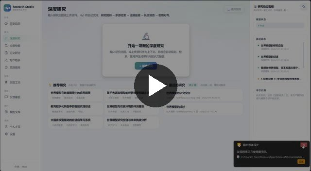
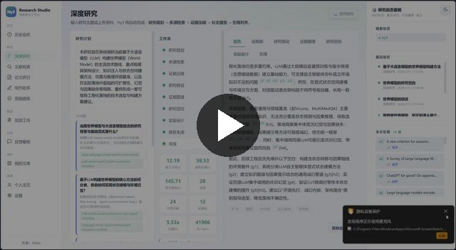
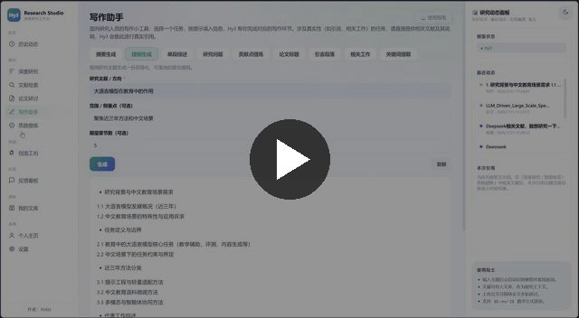
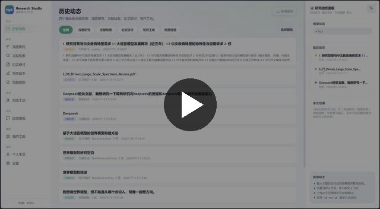
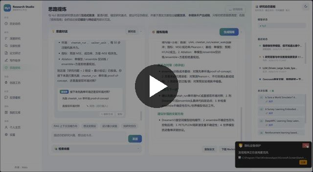

<div align="center">

# Hy3 Research Studio

**AI-Native Research & Creation Workbench · Powered by [Tencent Hy3](https://github.com/Tencent-Hunyuan/Hy3)**

[](https://www.python.org/)
[](https://fastapi.tiangolo.com/)
[](LICENSE)
[]()

*Tencent Rhinobird Open Source Talent Program · Build a vibe-coded application powered by Hy3*

[🌐 English](README.en.md) | [🇨🇳 中文](README.md)

</div>

---

## 📹 Demo Videos

The demo videos below cover all 11 modules. Click a thumbnail to watch (opens in GitHub's built-in video player).

---

### 🔬 Deep Research — 3m41s

> Flagship feature: enter a research topic → 8-stage automated pipeline (Planning → Retrieval → Compression → Hypothesis → Evidence Graph → Gaps → Experiment → Report) → SSE real-time progress bar → streaming report with [sN] citations → click citation to view source → multi-tab evidence pack/hypotheses/evidence graph/gaps/experiment design → chapter-level polish

[](docs/videos/deep-research.mp4)

---

### 🔍 Smart Search — 2m01s

> Multi-source academic search: parallel search across OpenAlex/Crossref/arXiv → Hy3 query optimization (Chinese→English) → LLM semantic filtering → paper card list → one-click save to library → streaming structured search brief with citations → filter by year/type/open access

[](docs/videos/smart-search.mp4)

---

### 💡 Idea Refiner — 2m11s

> Agent mode: research coach dialogue → forced retrieval-before-answer (tool_choice enforces retrieve_papers) → "searching real literature" indicator → two-layer filtering (keyword + semantic) → streaming answer with [rN] citations → Hy3 auto-generates 2-4 follow-up choice buttons → multi-turn convergence mechanism

[](docs/videos/idea-refiner.mp4)

---

### 📄✍️ Paper Seminar & Writing Studio — 1m50s

> **Paper Seminar**: PDF upload & parsing → chat with full paper content (summarize contributions/analyze limitations/extract outline) → multi-turn dialogue with full paper context → upload history
>
> **Writing Studio**: 4 writing tools (abstract generator/outline generator/paragraph expander/literature review writer) → input key points → streaming output → history tracking

[](docs/videos/paper-writing.mp4)

---

### 🔨 Feature Workshop — 1m25s

> ⚠️ Proof of Concept demo: marketplace with 4 official templates (Research/Review/Meeting/Medical) → AI Quick Build one-sentence creation (input description → Hy3 generates name/emoji/system prompt/layout/prompts) → independent workspace with specialized layout (meeting dual-column) → guided prompt bubbles → exit/re-entry state management

[](docs/videos/feature-workshop.mp4)

---

### 📚📊🕐👤⚙️ Library / Feedback / History / Profile / Settings — 1m53s

> **📚 Library**: cross-module paper collection, folder organization, notes, cross-session persistence
>
> **📊 Feedback**: submit feedback, word cloud visualization, voting, sorted by votes
>
> **🕐 History**: cross-module unified activity log, module filtering, resume last session
>
> **👤 Profile**: identity/affiliation/research interests, personalized "guess you want" recommendations
>
> **⚙️ Settings**: API key management, search source toggles, default preferences, model status, data management

[](docs/videos/history-settings.mp4)

---

## What is Hy3 Research Studio?

Hy3 Research Studio is a **research-workflow-centric**, end-to-end research and creation workbench powered by Tencent's Hy3 large language model. Unlike generic chatbots, it transforms vague research ideas into executable research plans — through multi-source literature retrieval, evidence compression, hypothesis generation, research gap identification, experiment design, and finally a fully cited academic report.

**No Node.js, no database, no Docker required.** Just Python 3.10+ and a Hy3 API key.

---

## ⚠️ Project Status

| Module | Status | Notes |
|--------|--------|-------|
| 🔬 Deep Research | ✅ **Production-ready** | Full 8-stage pipeline, SSE streaming, Hy3-integrated |
| 🔍 Smart Search | ✅ **Production-ready** | Multi-source search + query optimization + semantic filtering |
| 💡 Idea Refiner | ✅ **Production-ready** | Agent + Tool Calling, forced retrieval with citations |
| 📄 Paper Seminar | ✅ **Functional** | PDF upload + full-text chat |
| ✍️ Writing Studio | ✅ **Functional** | Abstract/outline/paragraph/review tools |
| 🔨 Feature Workshop | ⚠️ **Proof of Concept** | See details below |
| 📚 Library / 📊 Feedback / 🕐 History / 👤 Profile / ⚙️ Settings | ✅ **Production-ready** | Full-featured |

### 🔨 About the Feature Workshop

The Feature Workshop is a **forward-looking concept** proposed in this project: instead of merely saving prompts, users create AI micro-apps (AI Native Features) with dedicated interfaces, custom layouts, and AI capabilities — generated from a single sentence or visual drag-and-drop.

**Current status:**
- ✅ **AI Quick Build** works: generates name/emoji/system prompt/layout type/starter prompts from a description; generated features chat properly in the generic chat layout with custom system prompts
- ✅ UI layout HTML for 4 official templates (Research/Review/Meeting/Medical) is complete
- ✅ Marketplace data layer complete (favorites/ratings/forks/category browsing)
- ⚠️ The 6 specialized layouts (3-column research, review, meeting, medical, experiment, coding) currently use **hardcoded mock data** on the frontend; they do not yet inject feature system prompts into AI interactions
- ⚠️ The Visual Builder has a complete UI framework and basic drag-and-drop, but component property editing, nested layouts, and component connections are **not yet implemented**
- ⚠️ Some specialized layout frontends call a non-existent API endpoint (`/api/chat`); AI chat in specialized layouts is not wired to the correct backend

**On development difficulty:** A complete Feature Workshop requires solving the hard problem of "natural language → component tree → data flow → AI interaction logic" automatic generation, involving low-code engine design, component schema abstraction, and constraint validation for AI-generated UIs. The current PoC demonstrates the product vision and interaction design. Future iterations include: unified component schema, migrating specialized layouts to a generic component rendering engine, completing Visual Builder property panels with live preview, and enabling feature export/share/install.

---

## 🚀 Quick Start

### Prerequisites

- Python 3.10+
- A modern browser (Chrome / Edge / Firefox)
- A Hy3 API key (Tencent TokenHub or any OpenAI-compatible provider)

### 3 Steps to Run

```bash
# 1. Clone
git clone https://github.com/Xtdzs/Hy3-Research-Studio.git
cd "Hy3 Research Studio"

# 2. Install dependencies (7 packages, no Node.js needed)
pip install -r requirements.txt

# 3. Configure API key
# Windows PowerShell:
Copy-Item .env.example .env; notepad .env
# macOS / Linux:
# cp .env.example .env && nano .env
```

Edit `.env` with your API key:

```env
HY3_API_KEY=sk-your-key-here
HY3_BASE_URL=https://tokenhub.tencentmaas.com/v1
HY3_MODEL=hy3
```

Start the server:

```bash
python run.py
```

Open **http://localhost:8731** in your browser. All data (research tasks, library, features, settings) is persisted as JSON in the `data/` directory and survives restarts.

---

## 🧩 Feature Modules

### 1. 🔬 Deep Research — Flagship

The core end-to-end capability. Input a research topic and Hy3 orchestrates an **8-stage automated research pipeline**:

| Stage | Description |
|-------|-------------|
| ① Planning | Hy3 decomposes the topic into 2-5 sub-questions, generates English search queries, drafts a report outline |
| ② Multi-source Retrieval | Parallel search across OpenAlex/Crossref/arXiv; keyword filtering + LLM semantic relevance judgment |
| ③ Evidence Compression | Raw abstracts compressed into structured Evidence Packets (claim/method/limitation/supporting citations), 5:1~10:1 ratio |
| ④ Hypothesis Generation | Derives 3-5 falsifiable research hypotheses with confidence scores |
| ⑤ Evidence Graph | Identifies logical relationships (support/contradict/extend/specialize) between evidence packets |
| ⑥ Research Gaps | Mines uncovered directions from evidence limitations |
| ⑦ Experiment Design | Designs validation experiments (method/dataset/metrics/baselines/expected results) |
| ⑧ Report Writing | Section-by-section streaming output; key claims have clickable `[sN]` citations |

**Key features:**
- Real-time SSE progress bar showing all 8 stages
- Typewriter-effect streaming for report sections
- Click `[sN]` citations to slide out source paper info panel
- Section-level refinement: expand/condense/change tone/add citations/counter-argument
- Tabbed views for Evidence Packets, Hypotheses, Evidence Graph, Gaps, Experiments
- Configurable depth (Quick/Standard/Deep), target citation count, style (academic/technical/popular), language

### 2. 🔍 Smart Search

- Simultaneously searches OpenAlex, Crossref, arXiv (Semantic Scholar optional)
- Hy3 auto-optimizes queries (Chinese→English rewriting, keyword extraction)
- LLM semantic filtering removes irrelevant results
- Streaming generation of structured search briefs with citations
- One-click save to Library
- Filters: year range, paper type, open access only

### 3. 💡 Idea Refiner — Agent Mode

A research coach built on **Agent + Function Calling**:
- **Forced retrieval before answering**: `tool_choice` forces Hy3 to call `retrieve_papers`, eliminating fabrication
- **Smart decisions**: Simple greetings skip retrieval; research questions auto-trigger search
- **Chinese query optimization**: Detects Chinese, rewrites to 2-5 English keywords, retries on empty results
- **Two-layer filtering**: Keyword rules + LLM semantic filter; irrelevant papers discarded before entering context
- Answers include `[rN]` citations (click to view source)
- **Convergence mechanism**: After 3+ rounds, injects convergence prompt toward actionable plans
- After each answer, Hy3 auto-generates 2-4 follow-up choice buttons
- "Generate Guide" converges multi-turn discussion into a structured research framework

### 4. 📄 Paper Seminar

- Full PDF text extraction via pypdf
- Ask questions about methodology/contributions/results/limitations
- Auto-extract outline, key innovations, experimental results
- Multi-turn conversation with full paper context
- Upload history auto-saved

### 5. ✍️ Writing Studio

Writing assistance tools:
- **Abstract Generator** — concise abstracts from key points
- **Outline Generator** — structured outlines for papers/proposals
- **Paragraph Expander** — bullet points → full paragraphs
- **Review Writer** — literature reviews with citations
- All tasks stream output; history preserved

### 6. 🔨 Feature Workshop — ⚠️ Proof of Concept

> See [Project Status](#-project-status) above. Currently PoC.

**Implemented:**
- **AI Quick Build**: One-sentence feature generation (name/emoji/prompt/layout/starter prompts); generic chat layout works with custom system prompts
- **Marketplace**: 4 curated official templates, card-based browsing
- **Community**: 1-5 star weighted ratings, Fork/Remix, favorites, usage counters, 10 categories
- **Dedicated workspace routing**: Each feature has its own URL (`#/feature/{id}`); stable exit/re-entry state management

**To be completed (concept stage):**
- AI interaction wiring for 6 specialized layouts (currently mock data)
- Visual Builder component property editing and real rendering
- Feature export/share/install mechanisms

Two creation modes:
- ⚡ **AI Quick Build**: One-sentence description, Hy3 generates in ~30s (zero barrier, works today)
- 🎨 **Visual Builder**: Multi-turn dialog → AI-generated component layout → drag-and-drop editing (UI framework complete, interactions pending)

### 7-11. Library / Feedback / History / Profile / Settings

- **📚 Library**: Cross-module paper saving, folder organization, notes, cross-session persistence
- **📊 Feedback Board**: Submit feedback, word cloud visualization, voting, vote-based sorting
- **🕐 History**: Unified cross-module activity log, filterable by module, resumable sessions
- **👤 Profile**: Identity/affiliation/research interests; two-tier personalization (immediate signals + stable interests) drives "guess you want to search"
- **⚙️ Settings**: API key management, search source toggles, default preferences, model connection status, data management

---

## 🏗️ Architecture

```
┌────────────────────────────────────────────────────────────┐
│                  Frontend (Vanilla JS SPA)                 │
│  Zero-build · SSE streaming · Hash routing · Dark theme    │
│  ┌──────┬──────┬───────┬───────┬────────┬─────────────────┐│
│  │ Deep │Smart │ Paper │Writing│ Idea   │  AI Feature     ││
│  │Research│Search│Seminar│Studio │Refiner │  Workshop (PoC) ││
│  └──────┴──────┴───────┴───────┴────────┴─────────────────┘│
└──────────────────────────┬─────────────────────────────────┘
                           │ SSE + REST JSON
┌──────────────────────────┴─────────────────────────────────┐
│                   FastAPI Backend                          │
│  ┌─────────────┐  ┌──────────────┐  ┌────────────────────┐ │
│  │ 8-Stage     │  │ Retrieval    │  │ Feature Store      │ │
│  │ Pipeline    │◄─┤ Tool + RAG   │  │ (CRUD + Heuristic) │ │
│  └──────┬──────┘  └──────┬───────┘  └─────────┬──────────┘ │
│         │                │                     │            │
│  ┌──────┴──────┐  ┌──────┴───────┐  ┌─────────┴──────────┐ │
│  │ Prompt Eng  │  │ Multi-Source │  │ JSON File Store    │ │
│  │ (30+templates)│ │ Search Layer │  │ (zero DB)          │ │
│  └──────┬──────┘  └──────┬───────┘  └────────────────────┘ │
│         └────────────┬───┘                                 │
│                      ▼                                     │
│              ┌──────────────┐                              │
│              │  Hy3 Client  │  OpenAI-compatible API       │
│              │ stream/JSON/ │  + Function Calling          │
│              │ tool_calls   │                              │
│              └──────┬───────┘                              │
└─────────────────────┼──────────────────────────────────────┘
                      │ HTTPS
              ┌───────▼────────┐
              │   Hy3 API      │  Tencent TokenHub
              └────────────────┘

  Parallel: OpenAlex · Crossref · arXiv · Semantic Scholar
```

| Layer | Technology | Notes |
|-------|-----------|-------|
| Frontend | Vanilla HTML/CSS/JS | Zero build, zero Node dependency, served statically by FastAPI |
| Backend | Python 3.10+ / FastAPI / Uvicorn | Async SSE streaming |
| AI | Tencent Hy3 API (OpenAI-compatible) | API calls only; no training/fine-tuning/local deployment |
| Search | OpenAlex + Crossref + arXiv | No API key required out of the box; S2 optional |
| Documents | pypdf | PDF text extraction |
| Storage | JSON files | `data/` directory persistence; zero database dependency |
| Concurrency | ThreadPoolExecutor + threading.Lock | Parallel multi-source search + thread-safe writes |

---

## 🧠 Hy3's Roles in the System

Hy3 serves as the reasoning engine across all modules, taking on 16 roles:

| Role | Module | Task |
|------|--------|------|
| Research Planner | Deep Research | Sub-question decomposition, query generation, outline drafting |
| Search Query Optimizer | Search/Advisor | Chinese→English rewriting, core keyword extraction |
| Evidence Compressor | Deep Research | Compresses abstracts into structured evidence packets (5:1+) |
| Hypothesis Generator | Deep Research | Derives falsifiable hypotheses with confidence scores |
| Evidence Graph Builder | Deep Research | Identifies logical relationships between evidence |
| Gap Finder | Deep Research | Mines research gaps |
| Experiment Designer | Deep Research | Designs validation experiments |
| Report Writer | Deep Research/Smart Search | Section-by-section streaming long-form reports |
| Refiner | Deep Research | Expand/condense/restyle/add citations |
| Relevance Judge | Search Modules | LLM semantic filtering, per-paper relevance judgment |
| Research Coach | Idea Refiner | Multi-turn direction guidance with forced retrieval + citations |
| Paper Analyst | Paper Seminar | Answers paper questions, extracts outline/innovations |
| Feature Generator | Feature Workshop | One-sentence → AI micro-app configuration |
| Feature Designer | Feature Workshop | Multi-turn component layout generation (PoC) |
| Suggestion Engine | Home/Search | Personalized search suggestions from two-tier profile |
| LLM-as-Judge | Evaluation | Assesses evidence coverage and key point recall |

---

## 📁 Project Structure

```
Hy3 Research Studio/
├── backend/                    # Backend (FastAPI)
│   ├── main.py                 # API route entry (SSE + REST, 40+ endpoints)
│   ├── config.py               # Global config, .env loading
│   ├── hy3_client.py           # Hy3 client wrapper (stream/JSON/tool_calls)
│   ├── pipeline.py             # 8-stage deep research pipeline
│   ├── models.py               # Pydantic data models
│   ├── prompts.py              # 30+ prompt templates
│   ├── retrieval_tool.py       # Agent retrieval tool (Function Calling)
│   ├── search.py               # OpenAlex/Crossref/arXiv multi-source search
│   ├── store.py                # JSON persistence (tasks/library/history/settings)
│   ├── features.py             # Feature workshop data layer (CRUD/templates/heuristics)
│   └── feedback.py             # Feedback board data layer
├── frontend/                   # Frontend (zero-build SPA)
│   ├── index.html              # Main SPA page (all views)
│   ├── app.js                  # Frontend logic (routing/SSE/workspaces)
│   └── styles.css              # Dark theme styles
├── data/                       # JSON persistence (auto-created)
├── docs/                       # Documentation & assets
│   ├── videos/                 # Demo videos
│   ├── 技术报告.md              # Full technical report (Chinese)
│   ├── 视频录制脚本与字幕表.md   # Video storyboard + SRT
│   └── 创造工坊方案.md          # Feature workshop product spec
├── tests/                      # Tests & evaluation
│   ├── test_features.py        # Feature workshop unit tests
│   ├── test_offline.py         # Offline mode tests (no API key needed)
│   ├── evaluate.py             # 3-system comparison framework
│   └── benchmark_tasks.json    # Evaluation benchmark tasks
├── requirements.txt            # Python dependencies (7 packages)
├── .env.example                # Config template
├── run.py                      # One-click launch script
├── LICENSE                     # MIT License
├── README.md                   # Chinese README
└── README.en.md                # This file
```

---

## 📊 Evaluation Framework

Runnable comparison scripts evaluating three systems:

| System | Description |
|--------|-------------|
| `baseline_A` | Direct Chat: one-shot model response, no retrieval |
| `baseline_B` | Search + Single-pass: retrieval then dump all abstracts into one prompt (no compression) |
| `studio` | Full Hy3 Research Studio 8-stage pipeline |

```bash
python -m tests.evaluate --quick    # Quick eval (2 tasks)
python -m tests.evaluate            # Full eval
python -m tests.test_offline        # Offline unit tests (no API key needed)
```

Metrics:
- **Efficiency**: Total token consumption, end-to-end latency, TTFP/TTFE/TTFR/TTR timings
- **Compression**: Evidence Compression Ratio (before/after character ratio)
- **Quality**: Evidence Coverage (LLM-as-judge key point recall rate)

---

## ⚙️ Configuration

| Variable | Default | Description |
|----------|---------|-------------|
| `HY3_API_KEY` | (empty) | **Required**, Hy3 API key |
| `HY3_BASE_URL` | `https://tokenhub.tencentmaas.com/v1` | API endpoint (OpenAI-compatible) |
| `HY3_MODEL` | `hy3` | Model name |
| `HY3_TIMEOUT` | `120` | Request timeout (seconds) |
| `DEFAULT_SOURCES` | `openalex,crossref,arxiv` | Default search sources |
| `MAX_SOURCES_PER_QUERY` | `6` | Max results per query |
| `HTTP_TIMEOUT` | `20` | Search request timeout (seconds) |
| `S2_API_KEY` | (empty) | Optional, Semantic Scholar key for enhanced recall |
| `PORT` | `8731` | Server port |

---

## 🤝 CodeBuddy Collaboration

This project was built in collaboration with **CodeBuddy + Hy3**, which could efficiently speed up my development.

---

## 📝 Notes

- This project calls Hy3 **entirely through API**; there is no training, fine-tuning, or local model deployment
- Search relies on OpenAlex / Crossref / arXiv public APIs; if unavailable, UI remains browsable and AI features show offline fallback messages
- All data is stored as JSON in the `data/` directory; backup or delete to reset
- When `HY3_API_KEY` is not configured, the system enters offline mode: Feature Workshop uses heuristic layout inference; other AI features prompt for key configuration
- The Feature Workshop specialized layouts are currently in PoC stage with mock data; see [Project Status](#-project-status)

---

## 📄 License

MIT License

---

<div align="center">

**Built with [Tencent Hy3](https://github.com/Tencent-Hunyuan/Hy3) · CodeBuddy Assisted**

Submitted to [Tencent-Hunyuan/Hy3](https://github.com/Tencent-Hunyuan/Hy3) `rhinobird2026` branch · v0.0.1

</div>
